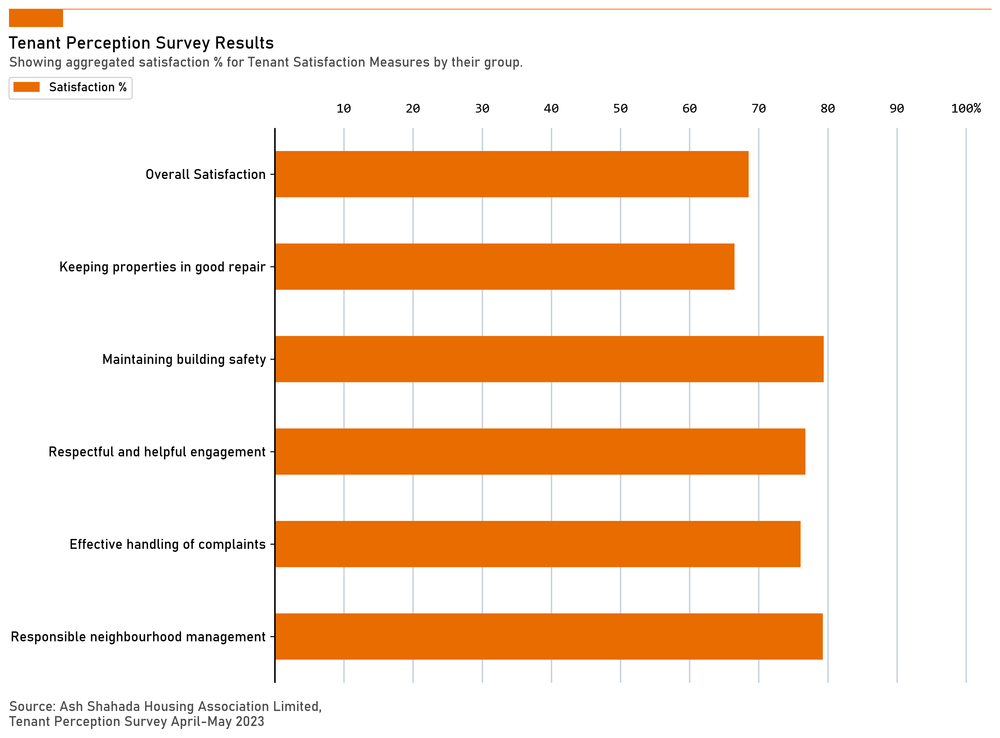

# Sort values in a multilevel index pivot table

Sorting in multilevel index pivots can be done like so, utilising reindex and `slice notation`.

```python
brand_color = '#e86c00'
section_order = ["Overall Satisfaction", "Keeping properties in good repair", "Maintaining building safety", "Respectful and helpful engagement", "Effective handling of complaints", "Responsible neighbourhood management"]
pvt = pdf.pivot_table(index=['Section'], columns='Weighting', values='ID', aggfunc='count', fill_value=0)
pvt['Satisfaction'] = round((pvt.iloc[:, 3:5].sum(axis=1)) / pvt.iloc[:, 0:5].sum(axis=1) * 100,2) # calculate satisfaction

# reorder by category order
pvt = pvt.reindex(category_order[::-1]) # reverse the list using slice notation
q_number_labels = list(pvt.index.get_level_values('Section').unique())
```

Full code:

```python
brand_color = '#e86c00'
category_order = ["Overall Satisfaction", "Keeping properties in good repair", "Maintaining building safety", "Respectful and helpful engagement", "Effective handling of complaints", "Responsible neighbourhood management"]
pvt = pdf.pivot_table(index=['Section'], columns='Weighting', values='ID', aggfunc='count', fill_value=0)
pvt['Satisfaction'] = round((pvt.iloc[:, 3:5].sum(axis=1)) / pvt.iloc[:, 0:5].sum(axis=1) * 100,2) # calculate satisfaction

# reorder by category order
pvt = pvt.reindex(category_order[::-1]) # reverse the list using slice notation
q_number_labels = list(pvt.index.get_level_values('Section').unique())

fig, ax = plt.subplots(figsize=(10,8))
pvt[['Satisfaction']].plot(kind='barh', ax=ax, lw=1.2, color=brand_color, zorder=2)
ax.legend().set_visible(False)

# styling
ax.plot([-0.17, .92],                 # Set width of line
        [1.045, 1.045],                # Set height of line
        transform=fig.transFigure,   # Set location relative to plot
        clip_on=False, 
        color=brand_color, 
        linewidth=.6)

ax.add_patch(plt.Rectangle((-0.17, 1.045),               # Set location of rectangle by lower left corder
                           0.06,                       # Width of rectangle
                           -0.025,                     # Height of rectangle. Negative so it goes down.
                           facecolor=brand_color, 
                           transform=fig.transFigure, 
                           clip_on=False, 
                           linewidth=.6))

# title and source
ax.text(x=-0.17, y=.990, s="Tenant Perception Survey Results", transform=fig.transFigure, ha='left', fontsize=14, weight='bold', fontname="Bahnschrift")
ax.text(x=-0.17, y=.965, s="Showing aggregated satisfaction % for Tenant Satisfaction Measures by their group.", 
        transform=fig.transFigure, 
        ha='left', 
        fontsize=11, 
        alpha=.7, 
        fontname="Bahnschrift")

ax.text(x=-0.17, y=0.05, s="Source: Ash Shahada Housing Association Limited,\nTenant Perception Survey April-May 2023", 
        transform=fig.transFigure, 
        ha='left', 
        fontsize=11, 
        alpha=.7, 
        fontname="Bahnschrift")

custom_legend = [
    mpatches.Patch(color=brand_color, label='Satisfaction %')
]

# Add the legend to the plot
legend_font = {'family': "Bahnschrift", 'size': 10, 'weight': 'bold'}
fig.legend(handles=custom_legend, loc=(0, 0.5), bbox_to_anchor=(-0.17, 0.92),  ncol=4, fontsize=10, prop=legend_font)

# adjust grid
ax.grid(which='major', axis='x', color='#A8BAC4', lw=1.2, alpha=.6, zorder=1)

# adjust spines
for spine in ["bottom", "top", "right"]:
    ax.spines[spine].set_visible(False)
ax.spines["left"].set_lw(1.2)
ax.spines["left"].set_capstyle("butt")

# adjust y axis
ax.yaxis.set_ticks(range(0, len(q_number_labels)))
ax.yaxis.set_ticklabels(q_number_labels, fontfamily="Bahnschrift")
ax.yaxis.set_tick_params(labelsize=11)
ax.set_ylabel(None)
# ax.yaxis.set_tick_params(labelleft=False, labelright=True)

# adjust x axis
x_labels = [" ",10,20,30,40,50,60,70,80,90,'100%']
ax.xaxis.set_ticks(np.arange(0,101,10))
ax.xaxis.set_ticklabels(x_labels, fontfamily='Consolas',va='bottom')
ax.set_xlim(0, 101)
ax.xaxis.set_tick_params(labeltop=True, labelbottom=False, length=0, pad=10, labelsize=11)

plt.savefig('images/area-satisfaction.png', dpi=300, bbox_inches='tight', facecolor='white')
plt.show()
```

