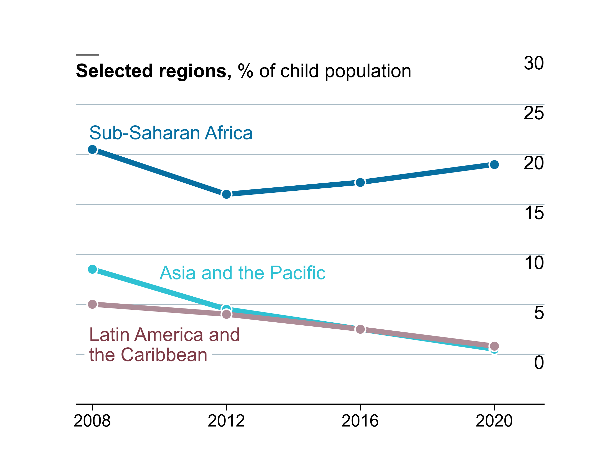

# Best practice: Line plots

Below is example code for a best practice lineplot, which can be tailored to other use cases:

```python
# packages
import pandas as pd
import numpy as np
import matplotlib.pyplot as plt
from flexitext import flexitext
from matplotlib import lines
from matplotlib import patches
from matplotlib.patheffects import withStroke

# Define colors and fonts to be used in charts
BROWN = "#AD8C97"
BROWN_DARKER = "#7d3a46"
GREEN = "#2FC1D3"
BLUE = "#076FA1"
GREY = "#C7C9CB"
GREY_DARKER = "#5C5B5D"
RED = "#E3120B"
FONTFAMILY = "Arial"

# Data section
year = [2008, 2012, 2016, 2020]
latin_america = [10, 9, 7.5, 5.8]
asia_and_pacific = [13.5, 9.5, 7.5, 5.5]
sub_saharan_africa = [25.5, 21, 22.2, 24]
percentages = [sub_saharan_africa, asia_and_pacific, latin_america]

COLORS = [BLUE, GREEN, BROWN]  # applied in order of index and of the percentages list above i.e BLUE is sub_saharan__africa

# plot the graph
fig, ax = plt.subplots(figsize=(8,6))

# zorder dictates dots to be on top of lines
# iterate through the percentages and colors lists and plot them on the same graph
for percentage, color in zip(percentages, COLORS):
    ax.plot(year, percentage, color=color, lw=5)
    ax.scatter(year, percentage, fc=color, s=100, lw=1.5, ec="white", zorder=2)

# customise the y axis
ax.yaxis.set_ticks([i * 5 for i in range(0,7)])
ax.yaxis.set_ticklabels([i * 5 for i in range(0,7)])
ax.yaxis.set_tick_params(labelleft=False, length=0) # make invisible

# customise the x axis
ax.xaxis.set_ticks(year)
ax.xaxis.set_ticklabels(year, fontsize=16, fontfamily=FONTFAMILY, fontweight=100)
ax.xaxis.set_tick_params(length=6, width=1.2)

# Set gridlines to be below most artists/ lines and add grid lines on the Y axis
ax.set_axisbelow(True)
ax.grid(axis="y", color="#A8BAC4", lw=1.2)

# get rid of spines apart from the bottom spine
ax.spines["right"].set_visible(False)
ax.spines["left"].set_visible(False)
ax.spines["top"].set_visible(False)

# customise the bottom spine
ax.spines["bottom"].set_lw(1.2)
ax.spines["bottom"].set_capstyle("butt")

# set custom limits
ax.set_ylim(0, 35)
ax.set_xlim(2007.5, 2021.5)

# Add labels 
# This adds the y axis on the left over to the right
# The pad is equal to 1% of the vertical range (35 - 0)
PAD = 35 * 0.1

for label in [i*5 for i in range(0,7)]:
    ax.text(
        x=2021.5, y=label + PAD, s=label,
        ha="right", va="baseline", fontsize=18,
        fontfamily=FONTFAMILY, fontweight=100
    )
    
# path effect must be a list
# This stops the grid line from showing above the label, specifically Latin America and Carribean 
path_effects = [withStroke(linewidth=10, foreground="white")]
    
# using this function removes the need to repeat code
def add_region_labels(x, y, text, color, path_effects, ax):
    ax.text(
        x=x, y=y, s=text, color=color,
        fontfamily=FONTFAMILY, fontsize=18,
        va="center", ha="left", path_effects=path_effects       
    )
    
# create a list of dictionaries containing the information needed to be passed to agg_region_labels
# keys correspond to the variables of the function and the dictionary values will be used

region_labels = [
    {
        "x": 2007.9, "y": 5.8, "text": "Latin America and\nthe Caribbean", 
        "color": BROWN_DARKER, "path_effects": path_effects},
    {
        "x": 2010, "y": 13, "text": "Asia and the Pacific", 
        "color": GREEN, "path_effects": []
    },
    {
        "x": 2007.9, "y": 27, "text": "Sub-Saharan Africa", 
        "color": BLUE, "path_effects": []
    }
]

for label in region_labels:
    add_region_labels(**label, ax=ax)
    
# titles
# As Matplotlib does not provide any function to mix both normal and bold text, flexitext is used instead of traditional ax.text()
text = f"<name:{FONTFAMILY}, size:18><weight:bold>Selected regions,</> % of child population</>"
flexitext(x=0, y=0.975, s=text, va="top", ax=ax)

# add a small line to the top of the image using ax.add_artist
ax.add_artist(
    lines.Line2D(
        xdata=[0, 0.05], ydata=[1,1], lw=2, color="black",
        solid_capstyle="butt", transform=ax.transAxes
    )
)

plt.show()
```

