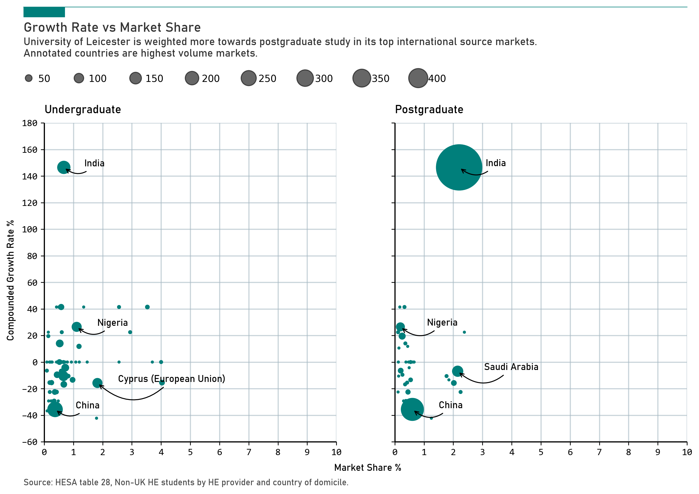

# Best Practice - Scatter Charts

This is a best practice example of a scatter graph, created using HESA data.

```python
# Fonts and colors
FONT_FAMILY = "Bahnschrift"
VALUE_FONT_FAMILY = "Consolas"
LEICESTER_RED = "#007f7b"
GRID_COLOR = "#A8BAC4"
TEXT_FONT_NAME = {'fontname' : 'Bahnschrift'}
VALUE_FONT_NAME = {'fontname' : 'Consolas'}

# Create scatter plot
fig, axes = plt.subplots(ncols=2,figsize=(12,6), sharex=True, sharey=True)
scatter1 = axes[0].scatter(x=df['LatestUGMarketShare%'], y=df['19/22 CAGR %'], s=df['All undergraduate'], zorder=3, color=LEICESTER_RED)
scatter2 = axes[1].scatter(x=df['LatestPGMarketShare%'], y=df['19/22 CAGR %'], s=df['All postgraduate'], zorder=3, color=LEICESTER_RED)

# Set titles for each subplot
axes[0].set_title('Undergraduate', fontname=FONT_FAMILY, loc="left", pad=10)
axes[1].set_title('Postgraduate', fontname=FONT_FAMILY, loc="left", pad=10)

# add shared x and y labels to the figure
fig.text(0.515, 0.04, 'Market Share %', ha='center', fontname=FONT_FAMILY)
fig.text(0.08, 0.5, 'Compounded Growth Rate %', va='center', rotation='vertical', fontname=FONT_FAMILY)

def adjust_styling(axes):
    # adjust y ticks and labels
    ax.set_yticks(np.arange(-60, 200, 20))
    ax.set_ylim(-60, 180)
    # x.set_ylabel("Compounded Growth Rate %", fontname=FONT_FAMILY)

    for label in ax.get_yticklabels():
        label.set_fontproperties(VALUE_FONT_FAMILY)

    # adjust x ticks and labels
    ax.set_xticks(np.arange(0, 11,1))
    ax.set_xlim(0, 10)
    # x.set_xlabel("Market Share %",  fontname=FONT_FAMILY)

    for label in ax.get_xticklabels():
        label.set_fontproperties(VALUE_FONT_FAMILY)

    # adjust grid
    ax.grid(which="major", axis="both", color=GRID_COLOR, alpha=0.6, lw=1.2, zorder=1)

    # adjust spines
    for spine in ["top", "right"]:
        ax.spines[spine].set_visible(False)
    ax.spines["bottom"].set_lw(1.2)
    ax.spines["bottom"].set_capstyle("butt")
    ax.spines["left"].set_lw(1.2)
    ax.spines["left"].set_capstyle("butt")
        
for ax in axes:
    adjust_styling(ax)

# Annotate top n countries for undergraduate
# Sort by population size and select top n countries
n = 5
top_ug_countries = df.nlargest(n, 'All undergraduate')
offset = 0.7
for i, country in top_ug_countries.iterrows():
    axes[0].annotate(text=country['Countryofdomicile'], 
                xy=(country['LatestUGMarketShare%'], country['19/22 CAGR %']),
                arrowprops=dict(arrowstyle='->', connectionstyle='arc3,rad=-0.5', linewidth=1),
                xytext=(country['LatestUGMarketShare%'] + offset, country['19/22 CAGR %'] + offset),
                fontname=FONT_FAMILY)
    
# Annotate top n countries for postgraduate
# Sort by population size and select top n countries
n = 4
top_pg_countries = df.nlargest(n, 'All postgraduate')
offset = 0.9
for i, country in top_pg_countries.iterrows():
    axes[1].annotate(text=country['Countryofdomicile'], 
                xy=(country['LatestPGMarketShare%'], country['19/22 CAGR %']),
                arrowprops=dict(arrowstyle='->', connectionstyle='arc3,rad=-0.5', linewidth=1),
                xytext=(country['LatestPGMarketShare%'] + offset, country['19/22 CAGR %'] + offset),
                fontname=FONT_FAMILY)
    
# Create custom legend handles and labels
handles, labels = scatter1.legend_elements(prop="sizes", alpha=0.6, num=10)

# Add legend to the plot
axes[1].legend(handles, 
          labels, 
          loc=(-1.3,1.11),  
          ncol=10, 
          frameon=False, 
          handletextpad=0.002, 
          handleheight=1,
          fontsize=10)

# styling
ax.plot([0.1, .90],                # Set width of line
        [1.16, 1.16],                # Set height of line
        transform=fig.transFigure,   # Set location relative to plot
        clip_on=False, 
        color=LEICESTER_RED, 
        linewidth=.6)

ax.add_patch(plt.Rectangle((0.1, 1.16),              # Set location of rectangle by lower left corder
                           0.05,                       # Width of rectangle
                           -0.025,                     # Height of rectangle. Negative so it goes down.
                           facecolor=LEICESTER_RED, 
                           transform=fig.transFigure, 
                           clip_on=False, 
                           linewidth = 0))

# title
ax.text(x=0.1, y=1.10, s="Growth Rate vs Market Share", transform=fig.transFigure, ha='left', fontsize=14, weight='bold', alpha=.8, fontname=FONT_FAMILY)
ax.text(x=0.1, y=1.04, s="University of Leicester is weighted more towards postgraduate study in its top international source markets.\nAnnotated countries are highest volume markets.", transform=fig.transFigure, ha='left', fontsize=11, alpha=.8, fontname=FONT_FAMILY)

# Set source text
ax.text(x=0.1, y=0.005, s="Source: HESA table 28, Non-UK HE students by HE provider and country of domicile.", transform=fig.transFigure, ha='left', fontsize=9, alpha=.7, fontname=FONT_FAMILY)

# savefig
plt.savefig("market-shares.png", dpi=300, bbox_inches="tight", facecolor="white")
```

