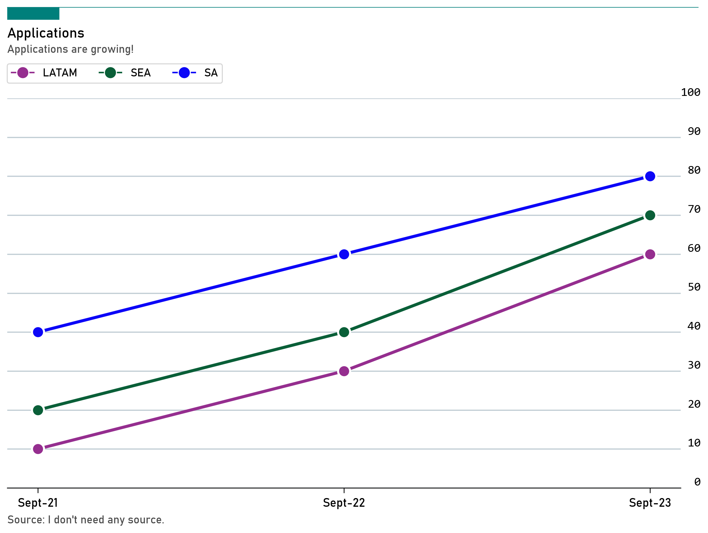

# Creating charts from pivoted data

When we have data that is already pivoted, we can use the below example to create line charts or other charts. It assumes the shape of the data is like so:

|    | Region   |   Sept-21 |   Sept-22 |   Sept-23 |
|---:|:---------|----------:|----------:|----------:|
|  0 | LATAM    |        10 |        30 |        60 |
|  1 | SEA      |        20 |        40 |        70 |
|  2 | SA       |        40 |        60 |        80 |

```python
import pandas as pd
import numpy as np
import matplotlib.pyplot as plt
import matplotlib.lines as mlines
import matplotlib.patches as mpatches

data = [
    ['LATAM', 10, 30, 60],
    ['SEA', 20, 40, 70],
    ['SA', 40, 60, 80]
]

df = pd.DataFrame(data=data, columns=['Region', 'Sept-21', 'Sept-22', 'Sept-23'])
region_colors = ['#952e8f', '#0a5f38', '#0c06f7']
categories = list(df['Region'].unique())

fig, ax = plt.subplots(figsize=(12,7))
for i, region in enumerate(df['Region']):
    region_data = df.loc[df['Region'] == region, ['Sept-21', 'Sept-22', 'Sept-23']]
    ax.plot(['Sept-21', 'Sept-22', 'Sept-23'], region_data.values[0], marker='o', markeredgecolor='white', markeredgewidth=2, markersize=12, lw=3, color=region_colors[i], label=region, zorder=2)
    
# adjust styling
# titles
ax.text(x=0.125, y=1, s="Applications", transform=fig.transFigure, ha='left', fontsize=14, weight='bold', fontname="Bahnschrift")
ax.text(x=0.125, y=.97, s="Applications are growing!", transform=fig.transFigure,  ha='left', fontsize=11, alpha=.7, fontname="Bahnschrift")

# Set source text
fig.text(x=0.125, y=0.04, s="Source: I don't need any source.", transform=fig.transFigure, ha='left', fontsize=11, alpha=.7, fontname="Bahnschrift")

# add fancy lines and rectangle
ax.plot([0.125, 0.92],
        [1.06, 1.06],
        transform=fig.transFigure,
        clip_on=False,
        color='#007F7B',
        linewidth=.6)

ax.add_patch(mpatches.Rectangle((0.125, 1.06),
                                0.06,
                                -0.025,
                                facecolor='#007F7B',
                                transform=fig.transFigure,
                                clip_on=False,
                                linewidth=.6))

# adjust grid
ax.grid(which='major', axis='y', lw=1.2, alpha=.7, color='#A8BAC4', zorder=1)

# adjust spines
for spine in ["left", "right", "top"]:
    ax.spines[spine].set_visible(False)
ax.spines[spine].set_lw(1.2)
ax.spines[spine].set_capstyle("butt")

# adjust x axis
for label in ax.xaxis.get_ticklabels():
    label.set_fontproperties("Bahnschrift")
ax.xaxis.set_tick_params(length=5, pad=5, labelsize=12)

# adjust y axis
ax.yaxis.set_ticks(np.arange(0, 101, 10))
ax.yaxis.set_ticklabels(np.arange(0, 101, 10), ha='right', va='bottom', fontfamily="Consolas")
ax.yaxis.set_tick_params(length=0, labelleft=False, labelright=True, labelsize=12, pad=20)

# custom legend
custom_legend = []
for i, cat in enumerate(categories):
    label = mlines.Line2D([], [], color=region_colors[i], linestyle='solid', marker='o', markeredgecolor='white', markersize=12, label=cat)
    custom_legend.append(label)

# Add the legend to the plot
legend_font = {'family': "Bahnschrift", 'size': 11, 'weight': 'bold'}
fig.legend(handles=custom_legend, loc=(0, 0.5), bbox_to_anchor=(0.125, 0.91), ncol=len(categories), fontsize=10, prop=legend_font)
    
plt.show()
```


